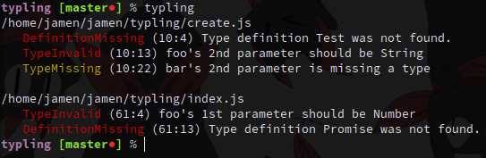

# typling

> Create and verify types from command line



## Installation

```sh
$ npm install --global typling
```

## Usage

```sh
$ typling [--help, --entry, --modules] [...globs]
```

 - `--help`: Print usage and flag descriptions
 - `--entry`: The entry directory for your relative paths.  Defaults to cwd
 - `--modules`: Allows `node_modules` to be globbed.  Defaults to `false`

Examples:

```sh
$ typling
$ typling lib/**/*.js
$ typling --modules
$ typling --entry=./lib foo.js bar.js
$ typling --help
```

## License

MIT © [Jamen Marz](https://git.io/jamen)

---

[][package] [](https://travis-ci.org/jamen/typling) [][package] [][package] [](https://paypal.me/jamenmarz/5usd) [](https://github.com/jamen)

[package]: https://npmjs.org/package/typling
